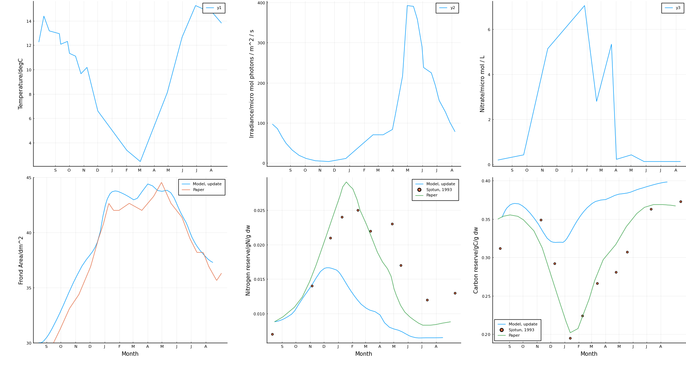
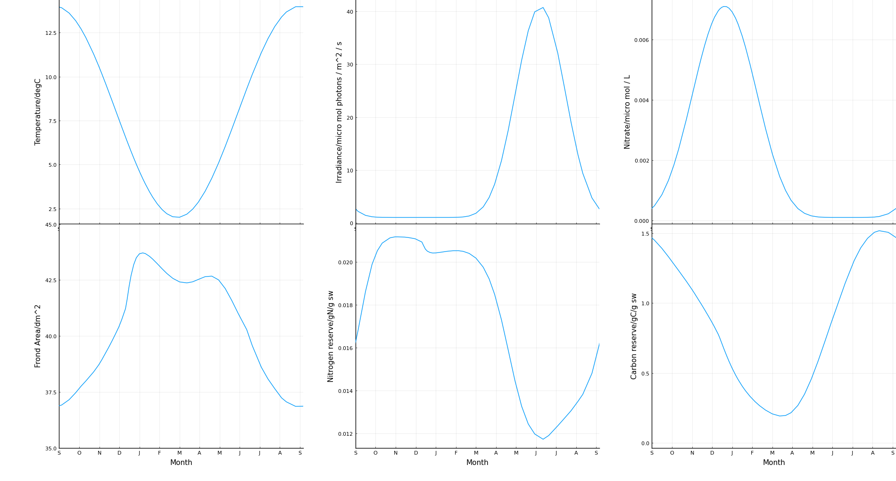

# Kelp

Implementation of [Broch and Slagstad model of the growth and composition of _Saccharina latissima_  Kelp](https://link.springer.com/article/10.1007/s10811-011-9695-y).

The model is solved by using `Kelp.solvekelp` with inputs:
- `t_i` the start day (where `t_i=1` is the first of January)
- `nd` the number of days to run for
- `u` an interpolation function of the relative current speed in m/s with respect to the day number with the same start day as `t_i`
- `temp` interpolation function of the temperature in deg C
- `irr` interpolation function of the irradiance in micro mol photons / m^2 / s
- `ex_n` interpolation function of the external nitrate concentration in micro mol / L
- `lat` latitude in degrees
- `a_0, n_0, c_0` the initial values of the area, nitrogen and carbon reserve fractions in dm^2, gN/g sw, gC/g sw

`Kelp.defaults` generates default series for temperature, irradiance and nitrogen as used by the paper.

## Current state

## Example
> :warning: This may be common knowledge but you have to run the example like `julia -i examples/default.jl` (not just `julia exa...`) otherwise the graphs immediately disappear.
`example/paper.jl` gives the above plot attempting to replicate the result from the paper.
`example/default.jl` runs the default values and the results will look something like this:

## Dependencies
(Don't know what the `requirments.txt` equivalent is in Julia)
- RecursiveArrayTools
- DiffEqBase
- OrdinaryDiffEq
- Roots
- Interpolations
- DataFrames
- Plots
- PyPlot
- Measures
Install them all with:

`import Pkg; Pkg.add(["RecursiveArrayTools", "DiffEqBase", "OrdinaryDiffEq", "Roots", "Interpolations", "DataFrames", "Plots", "PyPlot", "CSV"])`

## Some notes
- The example takes a fairly long time to run but when I checked plotting was taking more than half the time, the time to get going is fairly long too but can apparently be fixed with [precompilaiton](https://julialang.org/blog/2021/01/precompile_tutorial/).
- I don't think that I'm giving it the u/temp/etc. values in the best way.
- The formatting looks a bit funny but is what the autoformatting looks like, I also don't know the best way to comment and put in docstring equivalents in Julia yet.
- Also don't know how a Julia project should be formatted so have vaguely copied these two random examples - [Garlic.jl](https://github.com/cropbox/Garlic.jl) and [F16Model](https://github.com/isrlab/F16Model.jl).
